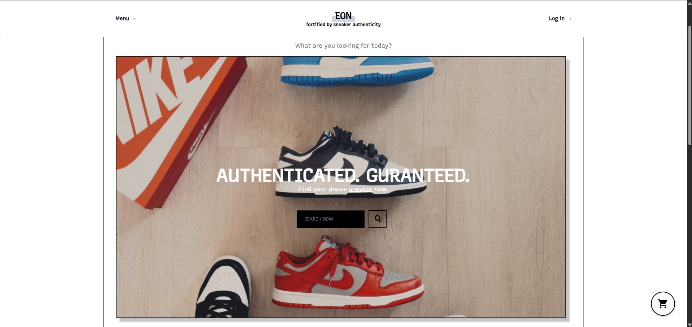

# My Project

A sample sneaker resell website for my school project.

## Table of Contents

- [Installation](#installation)

## Installation

1. **Install XAMPP**  
   Download and install XAMPP from https://www.apachefriends.org/.

2. **Clone the repo**

   ```bash
   git clone https://github.com/delvin02/sneaker.git
   ```

3. **Clone the repo**

   ```bash
   move sneaker C:\xampp\htdocs\
   ```

4. **Configure database details**

   ```
   // includes/utils.php
   define('DB_HOST',   'localhost');
   define('DB_USER',   'root');
   define('DB_PASS',   '');
   define('DB_NAME',   'sneaker_db');
   ```

   ```
   // db/connect.php
   $host     = 'localhost';
   $username = 'root';
   $password = '';
   $database = 'sneaker_db';
   ```

5. **Start Apache & MySQL**
   Open the XAMPP Control Panel and click Start next to Apache and MySQL.

6. **Initialize the database**

   ```
   http://localhost/sneaker/db/connect.php
   ```

7. **Access the web**
   ```
   http://localhost/sneaker/
   ```
